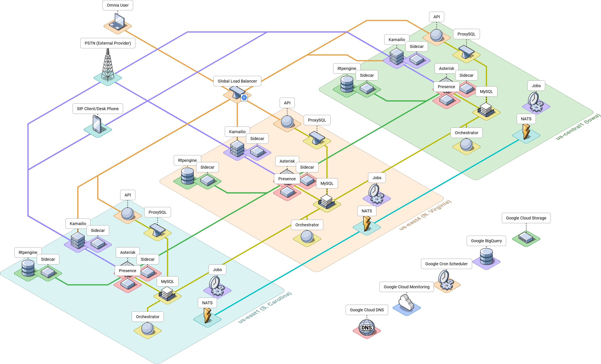

## Multi-region Kubernetes VoIP deployment

:white_check_mark: Easy to deploy

:white_check_mark: Multi region

:white_check_mark: Globally distributed

:white_check_mark: Scalable

:white_check_mark: Single global ingress

:white_check_mark: Auto-clustering

## Overview

[Slides](https://vibrant-easley-d0491e.netlify.app)

[Demo video](https://www.youtube.com/watch?v=MZDJuwR31KI)

[Astricon 2021 presentation](https://www.youtube.com/watch?v=vgOIIdYovZk&list=PLighc-2vlRgQTRb0PQCfFMDHuWjoUAKg4&index=3)

[Interactive Diagram](https://isoflow.io/project/cknuw4pyddjjq0738cnikqcbv)



This project assumes you have the following installed/configured
* gcloud SDK and a project setup in gcloud
* kubectl
* External IP in GCP (used for External HTTP(S) global LB)
* External IP's in GCP (used for Kamailio/Rtpengine)
* Secrets already created in [Secret Manager](https://console.cloud.google.com/security/secret-manager) (refer to `install.sh` for the naming convention)


`install.sh` 
----------
This takes care of the whole install process. Supported namespaces are `production`, and `staging`
* Create any google managed certs provided via command line args
* Create firewall rules for both `external-sip` and `external-rtp` traffic (both node pools)
* Obtain the MultiClusterIngress config cluster (since there can only be one)
* Create a cluster with a default node-pool and a node-pool with the `external-sip` and `external-rtp` network tags
* Deploy all resources in this repository to the cluster. Resources that depend on other clusters have DNS entries as env vars within each manifest file (E.g. NATS, Kamailio, db). These env vars are used to to have each new cluster be aware of the other clusters in other regions. There is no real limit to the amount of clusters that can be deployed globally as long as the DNS records are added to the appropriate manifest files.
* Deploys monitoring via prometheus and graphana (currently using Grafana Cloud but can use any self hosted deployment)

#### What you get
* Automatic firewall rules for both SIP/RTP
* 3 Node Pools (1 - default, 2 - external-rtp, 3 - external-sip)
* Handling of google-managed SSL certs
* Global HTTP(S) Multi-Cluster-Ingress Load balancer (handles websocket/WebRTC and all other HTTP traffic)
* Auto-assigning of Static IP's to nodes in the `external-rtp` and `external-sip` Node Pools via `kube-client`
* Enables the necessary API's in GCP for [MCS](https://cloud.google.com/kubernetes-engine/docs/how-to/multi-cluster-services), [MCI](https://cloud.google.com/kubernetes-engine/docs/concepts/multi-cluster-ingress), [Hub memberships](https://cloud.google.com/anthos/multicluster-management/connect/registering-a-cluster?cloudshell=true)
* Handling of [Config cluster setup](https://cloud.google.com/kubernetes-engine/docs/concepts/multi-cluster-ingress#config_cluster_design) setup

`base/`
---------
Contains all production manifests to be deployed in a production environment. `./install.sh --namespace production`

`base/ingress`
---------
This only gets deployed to the [Config Cluster](https://cloud.google.com/kubernetes-engine/docs/concepts/multi-cluster-ingress#config_cluster_design) which is determined in the install script automatically.

`staging/`
---------
Contains the staging environment (modifed by [kustomize](https://kustomize.io/)) to be deployed as a single cluster. `./install.sh --namespace staging`

## Production or staging install

Run `./install.sh` with options below
```
Usage: ./install.sh [options...]

-p, --project-id         Your google cloud project ID (optional - defaults to current project)
-r, --region             Specify the region to deploy the cluster. (optional - default is us-east1)
-s, --ssl-domains        Specify the domains to enable for google-managed SSL (optional)
-m, --machine-type       Specify the machine type (optional - default is c2-standard-4)
-n, --namespace          Specify the namespace to deploy into (optional - default is production)

Example:
Create new cluster:      ./install.sh --project-id my-project --ssl-domains 'api.myapp.com api2.myapp.com' --region us-central1 --machine-type n1-standard-2
Create staging cluster:  ./install.sh -r us-west1 -n staging -m n2-standard-8
```
